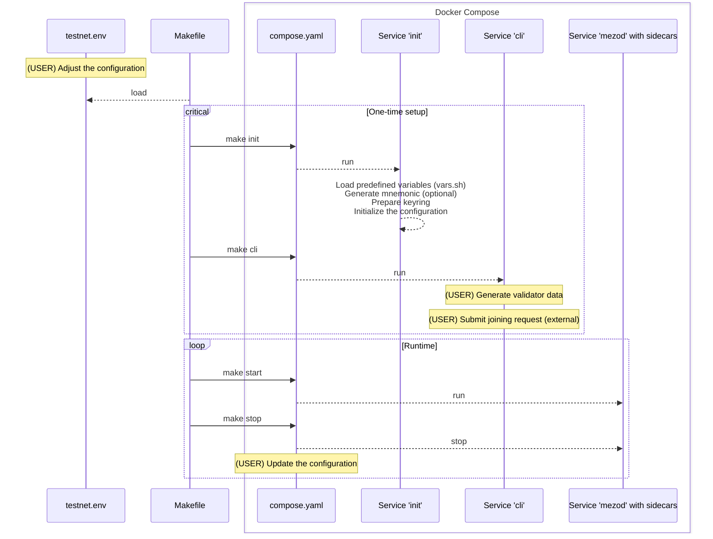

# Docker

## How to configure and run validator?

The following instruction will guide you through the process of configuring
and running a validator node. Before continuing, decide which network you want
to join. There are two options: `testnet` and `mainnet`. The following
instruction will use `testnet` as an example.

> [!NOTE]
> Run `make` (without arguments) to see the list of available commands.

#### Configuration and runtime flow



### 1. Prepare configuration file

1. Copy the `testnet.env.example` to `testnet.env`:

```shell
cp testnet.env.example testnet.env
```
2. Edit the `testnet.env` file:
* `NETWORK` - the network you want to join (`testnet` or `mainnet`)
* `DOCKER_IMAGE` - the latest version of mezod image
* `LOCAL_BIND_PATH` - the path to the local directory where the data will be stored
* `KEYRING_PASSWORD` - the password for the keyring. It is used to encrypt the key.
Generate a new password using the following command:
```shell
$ openssl rand -hex 32
```
* `MEZOD_MONIKER` - the name of the validator
* `MEZOD_ETHEREUM_SIDECAR_SERVER_ETHEREUM_NODE_ADDRESS` - the address of the Ethereum node


### 2. Initialize the configuration

```shell
make init
```

### 3. Generate validator data

```shell
make cli
$ echo "${KEYRING_PASSWORD}" | mezod genesis genval "${KEYRING_NAME}" --keyring-backend="file" --chain-id="${MEZOD_CHAIN_ID}" --home="${MEZOD_HOME}" --ip="${PUBLIC_IP}"
```

### 4. Submit joining request

TBD

### 5. Run the validator

```shell
make start
```
