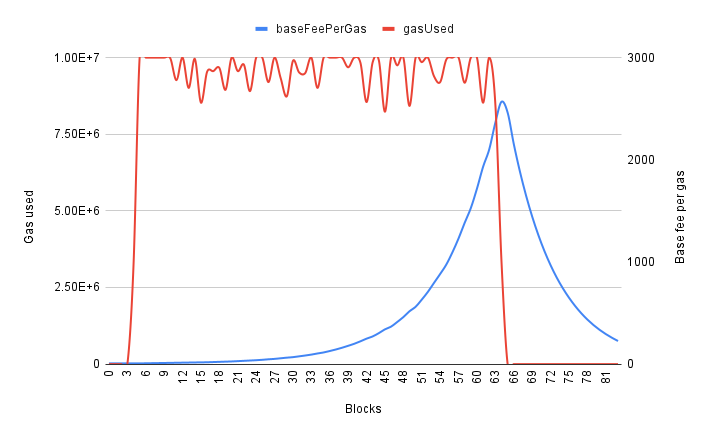
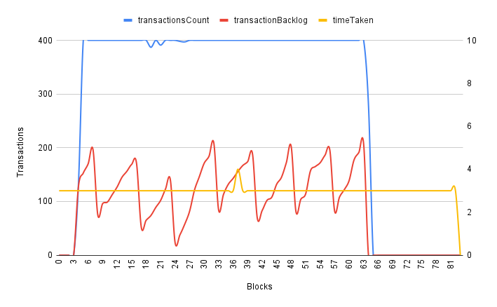
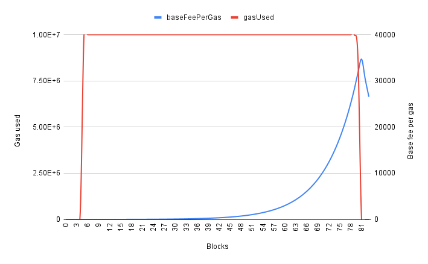

# Peformance tests report

## Introduction

This report presents a comprehensive analysis of the Mezo Node's (and EVM base blockchain)
performance testing, focusing on key parameters that affect transaction processing.

Our testing methodology was designed to evaluate the optimal configuration of three critical parameters:

- Gas per block: This parameter determines the maximum computational work allowed
  in a single block, directly impacting the number of transactions that can be
  processed in each block. Finding the right balance is essential - too low limits
  throughput, while too high may lead to network congestion and validation delays.

- CometBFT mempool size: The mempool serves as a transaction queue for pending operations
  awaiting inclusion in a block. Our tests examined various mempool configurations to identify
  the optimal size that balances memory usage with transaction throughput.

- Gas price mechanics: We analyzed how different gas price settings affect transaction
  prioritization within blocks. This parameter is crucial for understanding the economics
  of the network and establishing efficient fee markets that properly incentivize validators
  while maintaining accessibility for users.

## Notes regarding Mezo and Ethereum EVM behaviours

### Fee market (EIP-1559)

Both Mezo and Ethereum both implement EIP-1559, but with notable differences in their approach.

#### Gas price

While Ethereum's implementation introduced a base fee that gets burned and a priority fee
that goes to miners, Mezo adapted this model to fit its Cosmos-based architecture. In Mezo,
the fee market do not burn the base fees, per so not supporting deflationary tokenomics
similar to Ethereum.

Regarding the the fee tip / priority fee, Mezo also account for it in a different manner,
while Ethereum used this as a way of prioritising the transaction insertion into a block,
Mezo uses it in order only to confirm the transaction will pay enough gas to be added in the
block, not as a ordering mean.

#### Dynamic block sizing

[EIP-1559] on Ethereum introduced an approach to block capacity that isn't fully implemented in Mezo.

In Ethereum's implementation, while blocks have a target gas limit (currently 15M gas),
EIP-1559 established a flexible block size mechanism that can temporarily increase to handle
demand spikes. During high network congestion, Ethereum blocks can expand up to twice the
target size (30M gas), allowing the network to process more transactions when needed.

This elastic block capacity feature works in tandem with the base fee adjustment mechanism.
When blocks exceed the target size, the protocol increases the base fee more aggressively,
creating economic pressure to bring usage back to target levels while still accommodating
temporary surges in demand.

Mezo doesn't implement this dynamic block sizing capability. Instead, Mezo maintains fixed
block gas limits, which means its capacity cannot expand during high demand periods.

This design choice prioritize predictable block production times (expected to be 3.5 seconds),
but it does sacrifice some of the flexibility that Ethereum's implementation offers during
usage spikes.

#### Ethereum vs Mezo mempools behaviour

A critical architectural difference between Ethereum and Mezo lies in their mempool
management strategies. In Ethereum's implementation, transactions can remain in the mempool
indefinitely, regardless of changing network conditions or base fee fluctuations. This persistence
allows transactions to eventually be included when network congestion subsides or when
their gas price becomes competitive again relative to current demand.

Mezo, however, employs a more aggressive pruning approach to mempool management. When the
minimum gas fee for block inclusion increases due to network congestion, Mezo actively
removes transactions from the mempool whose gas price falls below this threshold. This is
fundamentally different from Ethereum's model, as it means transactions can be rejected
from the network entirely rather than simply waiting for inclusion during periods of lower demand.

This behavior is enforced through CometBFT (re)checkTx mecanism which continuously re-evaluates
all transactions in the mempool against current network conditions. While this approach
keeps the mempool cleaner and more reflective of current fee market conditions, it introduces
a significant computational overhead. As the mempool backlog grows, the constant validation
and re-checking of all pending transactions can consume substantial node resources, potentially
affecting overall network performance during sustained high-demand periods

For users, this distinction means that transaction submission strategies must be more
carefully thought on Mezo than on Ethereum. Transactions submitted with marginally
competitive gas prices that might eventually clear on Ethereum could be completely removed
from consideration on Mezo, requiring resubmission with higher fees.

#### Gas Limit per transaction and block sizing

Mezo takes a different approach to determining which transactions fit into a block compared
to Ethereum, particularly regarding block size calculations and gas consumption mechanics.

In Mezo, the effective space in a block is determined by a fixed gas limit per block, similar
to Ethereum. However, Mezo's transaction selection process differs significantly in how
it accounts for gas consumption:

##### Gas Accounting Differences

While Ethereum charges based on the actual computational resources used during execution (with
an upfront maximum specified by the user's gasLimit), Mezo implements a minimum gas consumption
rule. Specifically, Mezo will consume at least a factor of the gasLimit specified in a transaction,
regardless of the actual execution cost (by default this is set to half the gasLimit specified
in the transaction).
For example, if a user specifies a gasLimit of 100,000 for a transaction that actually requires
only 30,000 gas to execute:

- On Ethereum: The user would be charged for 30,000 gas (the actual cost)

- On Mezo: The user would be charged for 50,000 gas (half of the specified gasLimit)

This means that the effective cost of transactions on Mezo can be significantly higher than
their true computational cost, especially for transactions where the user overestimates the
required gasLimit as a safety measure.

##### Block Filling Implications

This gas accounting difference directly impacts how blocks are filled:

- Space Utilization: Even lightweight transactions consume more block space on Mezo than
  they would on Ethereum due to this minimum charge rule.

- Block Capacity Planning: Validators and users must account for this minimum gas consumption
  rule when estimating how many transactions can fit in a block, the effective capacity may
  be lower than what raw gas limit calculations would suggest.

This implementation creates different incentives for users compared to Ethereum.
On Mezo, there's a stronger incentive to accurately estimate gasLimit values, as overestimation
directly leads to higher costs through this minimum consumption rule. This stands in contrast
to Ethereum, where overestimating gasLimit has no cost penalty as long as the transaction
doesn't fail.

## Runs setups

### Hardware used

The hardware used to run the tests reflects the original requirements from [EVMOS]:

- dedicated CPU with 4 cores

- 32gb of RAM

- 200gb of disc (nvme)

Note that only the mezod node was running on the server, and 100% of the performances where dedicated to it.

### Transactions used for the tests

We used three transaction categories, each representing different levels of
computational complexity and gas consumption patterns:

- Native transfers: The most basic transactions type. These operations involve moving
  the native currency from one address to another without invoking any smart contract call.
  Native transfers represent the baseline for blockchain performance as they require minimal and known
  gas cost of 21000 gas. They involve simple state updates to account balances without
  executing any EVM code.

- Native transfers via ERC20 Precompile: The second category involved native token
  transfers executed through an ERC20 precompile. This approach uses a precompiled
  contract that exposes the native token through the standardized ERC20 interface.
  While the underlying operation is still a native token transfer, this method
  introduces additional overhead as it requires interacting with the precompile
  through the EVM. This transaction type represents an intermediate level of
  complexity and provides insights into how efficiently the Mezo Node handles
  precompiled contracts.

- ERC20 contract transfers: Finally we executed transfers using an actual
  deployed ERC20 token contract. Unlike the previous categories, these transactions
  involve full smart contract execution within the EVM. When a transfer is called on
  this contract, the node must load the contract's code from storage, execute the
  EVM operations defined in the contract (including balance checks, state updates,
  and event emissions), and persist the updated state. This transaction type
  represents realistic workloads commonly seen in production environments and
  provides the most relevant metrics for evaluating the node's performance for
  typical DApp operations.

### Metrics observed

The following metrics have been observed while running the perfomances tests:

- Gas consumed per block: This measurement reveals how efficiently the block space
  is being used and whether transactions are optimally packed into blocks. Consistent
  gaps between max gas and consumed gas might indicate opportunities to decrease max
  gas limits, while blocks consistently reaching the maximum suggest potential
  congestion issues that might require parameter adjustments.

- Mempool unconfirmed transaction: The count of pending transactions awaiting to be
  added in blocks indicates of network congestion. A growing mempool backlog
  signals that the network cannot process transactions at the rate they're being
  submitted. For Mezo Node specifically, monitoring this metric is crucial due to
  its transaction pruning behavior, as excessive mempool growth triggers more
  frequent re-checking operations that can impact node performance. Persistent
  mempool growth may indicate the need for increased block capacity or fee market
  adjustments.

- Transactions per blocks: An easier way to understand the gas consumed per block.

- Time take per block: How long validators takes to construct a valid block,
  including transaction selection, execution, and state updates. Extended block
  building times can lead to inconsistent block production intervals and
  reduced overall throughput (Mezo is trying to achieve block production every
  3.5 seconds in average). This measurement is especially relevant when
  evaluating how the re-checking behavior of the mempool affects validator
  performance under load.

- Gas price: This represent the cost per unit of gas, and reflect the current
  congestion level of the network. Under load the gas price will increase in an
  exponential manner, and decrease when the congestion of the network reduce.

### Scripts

The scripts used to run these tests are available in the mezod repository
[here](https://github.com/mezo-org/mezod/tree/main/tests/performance).

### Tests results

All tests are run for a period of 3 minutes, with bots sending transactions in a
constant flow to the node. Note that for all these transactions, the gasLimit
per transaction was set to:

- Native transfers: 21,000 gas
- ERC20 precompile transfers: 25,000 gas
- ERC20 transfers: 25,000 gas

For both the native and ERC20 precompile transfers, the entire gas allocation
would be consumed. For the ERC20 transfers, between 21,000 and 24,000 gas was
used, with the remainder being refunded. This behavior is the reason for the
differences in transaction count per block across the different transaction
types.

#### Regarding the mempool size

We have run some version of the tests with the CometBFT mempool set to a size
of 10,000 and 5,000. However the results didn't teach us anything relevant
if only the fact that it takes longer to empty out the a full mempool with a
bigger size.

For these reason, all following tests are run using a mempool of 10,000
transaction.

#### Performances comparison of the transactions

The following charts show execution at maximum capacity of the block, without
too much congestion on the node. The node consistently produces full blocks,
and the backlog is balanced - large enough to fill the next block but not
excessive.

We can easily see the natural increase in gas price. As soon as the flow of
transactions reduces, the gas price is affected and lowered.
The number of transactions in each block is similar, with a maximum of 476 for
native transfers and 400 for the others.

These charts show the blocks of 10M gas for the three transfer types under
similar loads as described previously.

##### Native transfers

##### ERC20 precompile transfers

##### ERC20 transfers

Note: because the results for the three transaction kind can be appreciated
in the previous charts, the following will focus only in comparing the load
of the node with different block gas size for an ERC20 transfer.

#### 10m gas per blocks

##### Under low stress

The charts in the previous section are relevant for the node behaviour under
low stress.

We can observe that the block time remains stable at 3 seconds consistently. The
node processes the mempool backlog in a regular pattern, and its size never
exceeds the amount of transactions that can fit in a block.

The network processes around 400 transactions per block, which amounts to a
total of approximately 24,000 transactions across 180 seconds.

##### Under high stress

The total number of transactions sent was 31,000 over 180 seconds.

In the following chart, we can see block production remains as stable as in the
previous charts (with two small peaks at 4 seconds per block).

In general, the node performs in the same range as under lighter loads; however,
we can observe that the gas price reached much higher peaks. This is due to the
high backlog (over 6,000). After the test stopped sending transactions, the node
had to continue processing the backlog for several seconds, creating fully filled
blocks for longer and impacting the gas price.

#### 12.5m gas per blocks

At 12.5M gas per block, the network can process around 500 transactions per block.

Because the results are similar for both high and low load, they will be covered
together.

The total number of transactions sent was 31,000 over 180 seconds for the lowest
load and 41,000 for the highest.

In the following chart, we can see block production remains as stable as in the
previous charts (with one peak at 4 seconds per block for low load and
four peaks for high load).

In general, the node performs in the same range under both loads; however,
we can observe that the gas price reached much higher peaks. This is due to the
high backlog (over 6,000). After the test stopped sending transactions, the node
had to continue processing the backlog for several seconds, creating fully filled
blocks for longer and impacting the gas price.

##### Under low stress

##### Under high stress

#### 15m gas per blocks

At 15m gas per block, the network can process around 600 transactions per blocks.

##### Under low stress

At low stress, the node processed 34,000 transactions in total, which equates to
188 transactions per second over 180 seconds.

The time taken to produce blocks remained stable, and the mempool size slowly
increased as the node was able to execute transactions sufficiently quickly.

The gas price increased steadily over time to support the transaction volume.

The node was running close to 100% CPU utilization, but we did not observe any
significant slowdown.

##### Under high stress

At higher stress, the node processed 39,000 transactions in total, which equates
to 216 transactions per second over 180 seconds.

At this rate, the mempool keeps growing continuously, and the time taken to
process blocks becomes less stable, with frequent peaks at 4 seconds and
occasional peaks at 5 seconds.

#### 17.5m gas per blocks

At 17.5m gas per block, the network can process around 700 transactions per blocks.

##### Under low stress

In the following, the node processed 44,000 transactions in 180 seconds (an average
of 244 transactions per second).

The time taken to produce blocks remained stable, and the mempool size slowly
increased as the node was able to execute transactions sufficiently quickly.

The gas price increased steadily over time to support the transaction volume.

The node was running close to 100% CPU utilization, but we did not observe any
significant slowdown.

##### Under higher stress

Here we sent a lot more transactions straight away, filling up the mempool rather
quickly. The first effect observed is the increased time taken to execute each
block (as high as 8 seconds per block), which is related to the time spent
running (re)checkTx on transactions.

We can also observe a negative effect on the gas price, which does not increase
as quickly over the same period. This is due to a lower number of blocks being
produced.

Because of this, the node can't prune transactions from the backlog as quickly
and reduce the load on the mempool.

Over this period, the node was able to process only 30,000 transactions.

[EIP-1559]: https://eips.ethereum.org/EIPS/eip-1559
[EVMOS]: https://evmos.org
