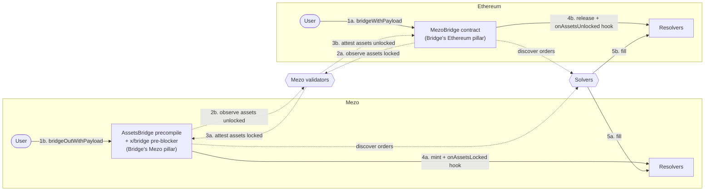

# RFC-7: Mezo bridge intents

## Background

The Mezo bridge described in [RFC-2](./rfc-2.md), [RFC-4](./rfc-4.md), and
[RFC-5](./rfc-5.md) currently moves BTC and ERC20 assets between Ethereum and
Mezo as simple value transfers. The user picks an asset, an amount, and a
recipient; the bridge mints or releases on the other side and the flow ends
there.

A growing class of cross-chain use cases needs more than that. A user on Mezo
may want to deposit BTC as collateral on an Ethereum lending market and
receive the borrowed stablecoin back on Mezo - all in one user-facing action,
without holding the funds on Ethereum themselves. A user on Ethereum may want
to bridge in and immediately interact with a Mezo protocol. Today these flows
require either a custom bridge integration per protocol or a series of manual
steps from the user.

This RFC adds an *intent* layer on top of the existing bridge so a single user
action can declaratively express "bridge these assets and do X with them on
the other side". The design follows the shape of
[ERC-7683](https://eips.ethereum.org/EIPS/eip-7683) - the emerging
cross-chain intent standard - so generic third-party fill infrastructure
can plug in without protocol-specific code.

### Terms used in this RFC

Borrowed from ERC-7683:

- **Order** - a user's cross-chain intent. Encoded as an opaque byte string we
  call the **Payload**, attached to the bridge transfer that funds it.
- **Resolver** - an on-chain contract owned by one protocol. It receives the
  bridged funds, custodies them, decodes the Payload, and exposes a view
  function `resolve(payload)` that returns a protocol-agnostic
  `ResolvedOrder` describing what work the Order needs.
- **Solver** - an off-chain actor that watches bridge events, picks Orders to
  fill, and submits the on-chain calls described by the `ResolvedOrder`.
  Solvers are untrusted and permissionless; anyone (including the user) can
  run one.
- **ResolvedOrder** - the protocol-agnostic structure a Solver consumes to
  fill the Order. The Solver does not need to understand the protocol; it
  interprets this structure mechanically. It has four parts:
    - **Steps** - the calls the Solver must submit, in order. Each Step is
      a description of a function call (target, selector, arguments).
    - **Variables** - placeholders inside Step arguments. Some are
      Solver-chosen (e.g. the address that should receive the Solver's
      payout); others are *Witnesses* the Solver must discover off-chain.
    - **Payments** - what the Solver earns and when. Each Payment binds an
      ERC20 transfer to a specific Step and Variable - e.g. "when Step 0
      executes, transfer X USDC from the Resolver to whatever address fills
      Variable 1".
    - **Assumptions** - preconditions the Resolver tells the Solver to
      verify off-chain before submitting. They let the Resolver communicate
      protocol-specific safety checks (like "the bridge hook has fired for
      this Order") to a generic Solver that does not hardcode them.

This RFC uses two Mezo-specific terms:

- **Bridge entry** (often just **entry**) - the bridge's existing internal
  record of a single transfer, keyed by a monotonic sequence number and
  carrying the recipient, token, amount, and `payloadHash`. The name comes
  straight from the `MezoBridge` contract, which already calls each such
  record an `entry`; this RFC uses "entry" for it throughout.
- **Bridge hook** - a callback the bridge invokes on the transfer recipient
  right after a bridge transfer completes, handing it the attested entry so
  it can react to the funds it just received. This RFC's intent system happens
  to make its Resolvers bridge hook targets as well, but that is not a hard
  requirement: a bridge hook target need not be a Resolver, and the two
  mechanisms are independent. Any registered contract - for example a reserve
  that wants to be notified of every deposit - can be a hook target.

### Scope

- The intent layer covers **both directions** symmetrically (Mezo→Ethereum
  and Ethereum→Mezo).
- The existing non-payload bridge paths (`bridgeTBTC` and `bridgeERC20` on
  Ethereum, `bridgeOut` on Mezo) keep working unchanged; the intent path is
  additive.
- One Resolver per protocol; no shared custodian or central settler.
- New Order types plug in by deploying new Resolvers, with no bridge changes
  required.

## Proposal

### Architecture overview

At a high level, the intent layer leaves the existing bridge intact and adds
three pieces around it: a payload-carrying entry point on each chain,
per-protocol Resolvers that receive the bridged funds, and permissionless
off-chain Solvers that drive Orders to completion. The diagram below shows how
they fit together across both directions; the flows are walked through beneath
it.



The two intent flows are mirror images. Each pillar of the bridge has two
roles:
the origin side accepts the user's bridge-with-payload call and publishes
events; the destination side, after the existing attestation pipeline
confirms the transfer, hands the funds to the destination-chain Resolver and
fires a hook. Solvers sit off-chain and watch both chains to discover Orders
and their fill conditions.

The bridge itself stays neutral: it transfers value, fires a hook, and emits
events. It does not know what an Order is, has no notion of Solvers, and does
not coordinate filling.

### Bridge-with-payload entry points

The intent path adds a new payload-carrying entry point on each chain, taking
the usual bridge arguments plus an extra `bytes calldata payload`:

- On Ethereum (`MezoBridge`): a single `bridgeWithPayload(token, amount,
  recipient, payload)` convenience entry point covering every fungible token.
  `MezoBridge` already composes `BitcoinBridge` (TBTC) and `ERC20Bridge`
  (other ERC20s) and has no plain `bridge` method, so `bridgeWithPayload`
  computes the payload hash and routes by token into `_bridgeTBTC` (the
  existing internal TBTC helper) or `_bridgeERC20` (a new internal helper
  factored out of `bridgeERC20`, mirroring how `bridgeTBTC` already delegates
  to `_bridgeTBTC`). One call thus serves both token kinds.
- On Mezo (`AssetsBridge` precompile): `bridgeOutWithPayload`, taking the
  same `(token, amount, chain, recipient, payload)` shape as `bridgeOut` plus
  the payload. A payload is only actionable when the recipient is a contract
  that can receive the bridge hook and act on it - i.e. on an EVM chain; a
  Bitcoin recipient is a plain script with no such execution. The only valid
  `chain` is therefore Ethereum, and the method reverts for any other target.
  The `chain` argument is kept rather than dropped so `bridgeOutWithPayload`
  stays a drop-in parallel of `bridgeOut` and leaves room for a future
  EVM-style destination.

The existing non-payload bridge paths (`bridgeTBTC`, `bridgeERC20`,
`bridgeOut`) keep working unchanged. A user who does not need an intent calls
the non-payload path.

Two existing Ethereum entry points are deliberately left out of the intent
path for now:

- **`bridgeTBTCWithPermit`** - the EIP-2612 permit variant of `bridgeTBTC`. A
  permit-based intent entry point is mechanical to add later (see
  [Gasless bridge-with-payload](#gasless-bridge-with-payload)) but is
  out of scope here.
- **Native BTC bridging** (`initializeBTCBridging` / `finalizeBTCBridging`) -
  this flow is one-directional (into Mezo only) and attaching intents to it is
  non-trivial, so it is out of scope and can be revisited separately.

When a user calls a `WithPayload` variant:

1. The origin-chain contract computes `payloadHash = keccak256(payload)`. If
   `payload` is empty, `payloadHash = bytes32(0)`. A non-empty payload that
   happens to hash to zero is impossible by construction.
2. The origin-chain contract performs the normal bridge action (lock or burn)
   and records a bridge entry that now carries `payloadHash` alongside the
   existing fields (sequence, recipient, token, amount).
3. The origin-chain contract emits the existing-shape bridge event (now also
   carrying `payloadHash`) **and** a companion `PayloadRecorded` event that
   publishes the plain payload bytes.

The plain payload bytes are published only via the companion event. They
never travel through validator vote extensions, cross-chain attestations, or
the destination-chain bridge state. Only the hash flows through those paths.
This keeps the on-chain data and the consensus pipeline bounded to a fixed
32 bytes per intent regardless of payload size.

#### Companion `PayloadRecorded` event

Both origin-chain contracts emit the same direction-agnostic event:

```solidity
event PayloadRecorded(uint256 indexed sequence, bytes32 indexed payloadHash, bytes payload);
```

It is emitted in the same transaction as the main bridge event.

Solvers watch both chains. The plain payload only lives on the origin chain
(in `PayloadRecorded`); the signal that the transfer has finalized - the
bridged funds have landed and the entry is now registered at the Resolver -
is observed on the destination chain. Exactly how that finalization surfaces
differs by direction; for discovery a Solver only needs to detect that it has
happened. A Solver therefore:

1. Detects a bridge-with-payload finalization on the destination chain (the
   Order is ready to fill).
2. Looks up the matching `PayloadRecorded` on the origin chain by `sequence`
   (the unique key it already has from step 1) to get the plain payload bytes.

`payloadHash` is **not** guaranteed unique across pending entries by the
bridge - two users can submit the same payload. The bridge's monotonically
assigned `sequence` number is therefore the only *bridge-guaranteed* unique
key, so the companion event indexes it alongside `payloadHash` and Solvers
correlate by `sequence`. A Resolver that prefers to address Orders by
`payloadHash` instead must enforce payload uniqueness itself and push that
responsibility onto the user.

#### Bridge entry schema

The existing Mezo-internal `AssetsLockedEvent` and `AssetsUnlockedEvent` proto
records gain a `bytes32 payload_hash` field, and so do their Ethereum-side
`MezoBridge` counterparts: the `AssetsLocked` event (emitted for the Eth→Mezo
lock) and the `AssetsUnlocked` struct (the attested Mezo→Eth unlock). (Naming
note: on Mezo we call the proto records `AssetsLockedEvent` /
`AssetsUnlockedEvent`; on Ethereum the counterparts are the `AssetsLocked`
event and the `AssetsUnlocked` struct. They carry the same fields.) The
existing non-payload bridge paths write `payloadHash = bytes32(0)`.

[RFC-4](./rfc-4.md) extends `AssetsLockedEvent`'s `Equal` to include the
`token` field, so a malicious validator cannot vote a different token for a
given sequence number. We extend that same equality check to also cover
`payload_hash`, so a validator likewise cannot vote two different payload
hashes for the same sequence number.

### Bridge hooks

When a bridge transfer completes on the destination chain (mint on Mezo,
release on Ethereum), the bridge checks whether the recipient is a registered
**hook target**. If it is, the bridge calls a hook on the recipient after the
existing mint or release.

A hook target does not have to be a Resolver. The hook mechanism is
independent of the intent layer: this RFC registers its Resolvers as hook
targets (see [Resolvers](#resolvers)), but any allowlisted contract can be
one.

Hook firing is decided by the registry alone. Whether a payload is attached
does not matter: a registered hook target receives the hook with whatever
`payloadHash` is in the entry (zero or non-zero); a non-registered recipient
never receives a hook even if a payload is attached. This keeps hooks
orthogonal to payloads - a hook target may use the hook for non-intent flows
too (e.g. a reserve that wants to be notified of every deposit).

#### Hook signatures

```solidity
// Implemented by Mezo hook targets (Resolvers, in this RFC's intent design).
// Called by the x/bridge pre-blocker on Eth→Mezo.
interface IAssetsLockedHook {
    function onAssetsLocked(AssetsLocked calldata entry) external;
}

// Implemented by Ethereum hook targets (Resolvers, in this RFC's intent
// design). Called by MezoBridge on Mezo→Eth.
interface IAssetsUnlockedHook {
    function onAssetsUnlocked(AssetsUnlocked calldata entry) external;
}
```

`AssetsLocked` and `AssetsUnlocked` are the existing bridge structs
extended with `payloadHash` (the same change described above).

#### Hook calling discipline

The bridge calls hooks under tight constraints on both sides:

- **Bounded gas.** Hooks run with a fixed gas limit (target: ~200k) so a
  hook target cannot grief block production on Mezo or attestation
  reimbursement on Ethereum.
- **Excessively safe call.** Return data is ignored; reverts and out-of-gas
  are caught.
- **Skip-on-failure.** A reverting or OOG hook is logged and ignored; the
  bridge does not halt. This matches the existing `mintERC20` policy in
  `x/bridge/keeper/assets_locked.go` - we already accept that one
  malfunctioning contract must not halt the chain. A failed hook lands the
  bridged funds at the recipient address without registering the finalized
  bridge entry in the hook's target state; from the recipient's perspective
  it is the same recovery class as a skipped mint today.

Hook targets cooperate with the bridge:

- **`onlyBridge` authentication** so the hook target only trusts the
  canonical bridge caller.
- **Idempotency.** Stateful hook targets (such as Resolvers) check that their
  entry slot for the transfer is unset before writing, defensively guarding
  against any future re-fire.

### Resolvers

A **Resolver** is a per-protocol contract owned by that protocol's governance.
It plays five roles for its protocol's Orders:

1. **Recipient.** The user's bridge-with-payload call sets the Resolver as
   the bridge recipient.
2. **Hook target.** The bridge fires `onAssetsLocked` / `onAssetsUnlocked` on
   it after the transfer; the Resolver records the bridge entry, indexed by a
   key of its choosing.
3. **Payload decoder (the ERC-7683 surface).** Exposes
   `resolve(bytes payload) → ResolvedOrder` so a generic Solver can learn
   what work the Order needs.
4. **Custodian.** Holds the bridged funds for each pending Order until it is
   filled (or refunded). Custody always stays with the Resolver.
5. **Executor.** Exposes a protocol-defined, Solver-callable method (typically
   `fill`-shaped) that drives the Order to completion. The Resolver MAY run
   the Order's steps itself, or MAY delegate execution to other contracts and
   release the custodied funds only against a verified output.

There is **no central settler** and no shared custodian. Each Resolver holds
only its own protocol's pending Orders, so a bug in one Resolver bounds blast
radius to that protocol's TVL.

#### Registry

The bridge maintains a small governance-managed allowlist of hook-target
addresses on each side (one allowlist per pillar); a Resolver participates by
being added to it. Adding an address is a governance action.

#### Spec conformance vs. extensions

ERC-7683 specifies `IResolver` as a pure-view payload decoder. Our Resolver
is decoder + hook target + custodian (+ optionally executor). Only the
`resolve(payload) → ResolvedOrder` method shape is spec-conformant; the rest
is a Mezo extension. The extension is what lets a single contract own all
state for its protocol's Orders.

#### Safety boundaries

A Resolver is exposed to permissionless Solver callers. The design isolates
what a malicious Solver can affect:

- **Cap and asset come from the stored bridge entry.** The Resolver records
  `(sequence, recipient, token, amount, payloadHash)` from the hook call.
  Any later release is bounded by those fields. The `ResolvedOrder` only
  controls interpretation (filler binding, deadlines, payment structure),
  never the cap.
- **Order keys are one-to-one with bridge-attested entries.** `sequence` is
  unique by construction at the bridge, so a Resolver can always index by it
  and treat `payloadHash` as an integrity check at fill time. A Resolver MAY
  instead index by `payloadHash`, but only by enforcing payload uniqueness
  itself. Either way the key maps to a single attested entry, so a Solver can
  never steer one Order's funds under another's parameters.
- **Solvers are untrusted by default.** Every recipient, amount, and target
  is determined by the bridge-attested entry plus the payload. A Solver can
  choose *when* to trigger a fill but never *what* happens. A protocol
  MAY add a Solver allowlist for its own reasons (e.g. bounding MEV), but
  the design does not require one.

The bridge has no notion of Solvers at all.

### Failure and recovery

What happens to an Order that no Solver ever fills is left to each Resolver.
The bridge has already delivered the funds to the Resolver and plays no part
in recovery, and this RFC does not mandate a deadline or a refund mechanism.
A Resolver will typically want some recovery path; one example is
refund-after-timeout, where the Resolver lets a designated recovery address
reclaim an unfilled Order's funds after a Resolver-chosen timeout. Whether to
impose a timeout at all, and how long it is, is entirely the Resolver's choice.

### Rollout on a live chain

The schema changes are consensus-breaking in three places: the vote-extension
wire format on Mezo (anti-equivocation now covers `payloadHash`), the
`MezoBridge` contract on Ethereum (both its `AssetsLocked` event and its
`AssetsUnlocked` attestation struct gain `payloadHash`), and the `AssetsBridge`
precompile on Mezo (it gains the new `bridgeOutWithPayload` method).

We therefore ship this RFC as a coordinated chain halt using the `Upgrade`
primitive (see [docs/upgrades.md](../upgrades.md)), paired with the
`MezoBridge` proxy upgrade in a single window.

#### New events

We do not rename the existing events. Each one is kept in the contract code -
now **deprecated** - so pre-upgrade logs stay decodable, but it is no longer
emitted. In its place we add a new `WithPayload` event that carries the extra
`payloadHash` field and, because its parameter list differs, has a different
`topic0`. Indexers, dApps, and block explorers that follow live bridge
activity must move to the `WithPayload` events; the deprecated events serve
only to decode historical logs.

The new events:

- On `MezoBridge` (Ethereum): `AssetsLockedWithPayload`,
  `AssetsUnlockWithPayloadAttested`, `AssetsUnlockWithPayloadConfirmed`.
- On `AssetsBridge` precompile (Mezo): `AssetsUnlockedWithPayload`.

(We also considered a `V2` suffix for the new events, but `WithPayload` reads
as more direct and clearer about what changed.)

Both origin-chain contracts also emit a direction-agnostic `PayloadRecorded`
event when a payload is attached. Every bridge action emits its `WithPayload`
event; a non-payload action carries `payloadHash == bytes32(0)` and emits no
`PayloadRecorded`.

#### Compatibility across the halt

In-flight bridges are preserved, not discarded, and existing indexer state
remains readable. The implementation handles three concerns:

- **In-flight Eth→Mezo bridges.** The new Ethereum sidecar accepts both
  legacy `AssetsLocked` and new `AssetsLockedWithPayload` events; legacy
  events still inside the finality wait at halt time are processed as
  `payloadHash = bytes32(0)`, no hook, plain mint.
- **In-flight Mezo→Eth attestations.** Pending `AssetsUnlockedEvent`
  records are not cleared by the halt's store migration; validators
  re-sign them under the new attestation schema in a one-time
  re-attestation pass after the halt.
- **Pseudo-tx reconstruction.** The `AssetsBridge` precompile is versioned
  via `version_map.go` and gated by block height, so pre-upgrade blocks
  reconstruct under the prior ABI and post-upgrade blocks under the new
  one. The indexer's stored proto records are forward-compatible because
  `payload_hash` is added additively.

### Worked example: Simple remote borrow

> **⚠️ Illustrative only.** The Solidity and the Resolver design in this
> section are a simplified demo meant to show how a generic Solver discovers
> and fills an Order. They are not production-grade and not safe to deploy
> as-is.

A user on Mezo holds BTC and wants to use it as collateral on Aave V3
(Ethereum) to borrow USDC, then receive that USDC back on Mezo. The
bridge-side mechanics are straightforward - bridge BTC out with a payload,
land it on the Ethereum Resolver, do the Aave work, bridge USDC back. The
interesting part is **how a generic Solver discovers and fills the Order
without protocol-specific knowledge** - that is the value ERC-7683 brings.

#### What the user does

The user makes a single call on Mezo:

```solidity
AssetsBridge.bridgeOutWithPayload(
    BTC,            // token
    btcAmount,      // amount
    ETHEREUM,       // chain
    ethBorrowResolverAddr, // recipient (the Ethereum Resolver)
    abi.encode(BorrowPayload({
        nonce:        uniqueNonce,    // MUST be unique — it alone makes this payload's hash distinct
        usdcToBorrow: 1000e6,
        solverFee:    2e6,            // USDC paid to whichever Solver fills
        userOnMezo:   userAddr        // final USDC recipient on Mezo
    }))
);
```

That is the entire user-facing action. Everything else is automated.

> **⚠️ The payload must be unique, and the user owns that guarantee.**
> This Resolver keys every Order by `keccak256(payload)` and admits each hash
> **at most once, for all time** — the "processed once" property. The `nonce`
> field is the only thing that distinguishes one borrow payload from an
> otherwise identical one, so the user **must** supply a fresh value for every
> Order: a random 32-byte word, or a counter they never repeat.
>
> If two bridge-outs ever carry the **same** payload, only the first becomes an
> Order. The bridge still delivers the second transfer's BTC to the Resolver,
> but the duplicate hook is refused, no Order is recorded against it, and
> **those funds are stuck** — no `fill` can ever reach them, and the bridge
> plays no part in recovery. Uniqueness is a hard precondition, not a
> best-effort hint.

#### What the Solver sees

A Solver is a generic off-chain actor. It does **not** know about Aave, this
protocol, or that the Order is a "borrow". It follows ERC-7683 mechanically:

1. **Discover an Order.** The Solver watches bridge events. When
   `MezoBridge.AssetsUnlockWithPayloadConfirmed(…, payloadHash)` fires with a
   non-zero `payloadHash`, an Order exists. The Solver fetches the plain
   `payload` from the matching `PayloadRecorded` event emitted on Mezo by the
   `AssetsBridge` precompile (where the user originally called
   `bridgeOutWithPayload`) and verifies `keccak256(payload) == payloadHash`.
   That hash is the Order's key *here* because this Resolver enforces payload
   uniqueness; the generic discovery path keys by the unique `sequence`
   instead.
2. **Resolve.** The Solver calls `Resolver.resolve(payload)` via `eth_call`.
   It receives a `ResolvedOrder` describing Steps (calls to make), Variables
   (placeholders — here just the Solver's own payout address), Payments (what
   the Solver earns), and Assumptions (what to verify off-chain).
3. **Check Assumptions.** Each Assumption names a precondition the Solver
   must verify off-chain before submitting. In this example: `chain-id`
   carries the chain the Resolver lives on, and the Solver confirms it is
   about to broadcast Step 0 to that chain. The same Resolver bytecode could
   sit at this address on other chains, so the Solver must target the one this
   `resolve` call ran on.
4. **Assign Variables.** The only Variable is Variable 0 (`PaymentRecipient`),
   which the Solver sets to its chosen payout address. There is nothing the
   Solver must discover off-chain to address the Order: the payload is
   self-identifying.
5. **Submit Step 0.** The Solver constructs the call described by Step 0
   with the variable filled in. In this example that resolves to
   `EthBorrowResolver.fill(payload, payoutAddress)`, where `payoutAddress` is
   the Variable the Solver just assigned. The Solver does not need to know what
   `fill` does - only that the attached `Payment` fires when the Step
   succeeds.
6. **Collect Payment.** The `Payment.ERC20` attached to Step 0 transfers
   `solverFee` USDC from the Resolver to the Solver's chosen recipient
   atomically with the Step.

The Solver could be operated by anyone, including the user themselves.
Nothing on-chain identifies a Solver in advance; they just submit Step
calls.

#### The Resolver

```solidity
contract EthBorrowResolver is IAssetsUnlockedHook, IResolver {
    struct BorrowPayload {
        bytes32 nonce;            // user-supplied; MUST be unique per Order
        uint256 usdcToBorrow;
        uint256 solverFee;
        address userOnMezo;
    }

    address public immutable MEZO_BRIDGE;
    address public immutable AAVE_POOL;
    address public immutable TBTC;
    address public immutable USDC;

    // Orders are keyed by keccak256(payload). This Resolver deliberately does
    // NOT key by the bridge `sequence`: it requires every payload to be unique
    // (the user supplies a uniqueness `nonce`) and addresses each Order by its
    // hash, so a Solver holding only the payload can act without discovering
    // anything off-chain. The bridge does not guarantee payloadHash uniqueness,
    // so the `admitted` guard below enforces process-once.
    mapping(bytes32 => AssetsUnlocked) public entries;   // payloadHash => entry

    // payloadHash => true once it has EVER been admitted. Never cleared. This
    // is the process-once guard: a payload is admitted at most once for all
    // time, so it can never be filled twice, and a duplicate bridge-out is
    // refused (its funds are stuck).
    mapping(bytes32 => bool) public admitted;

    modifier onlyBridge() { require(msg.sender == MEZO_BRIDGE, "not bridge"); _; }

    // Bridge hook. Skip-on-failure applies; we still revert defensively.
    function onAssetsUnlocked(AssetsUnlocked calldata e) external onlyBridge {
        // PROCESS-ONCE GUARD. The first transfer carrying a given payloadHash
        // is admitted as an Order; any later transfer with the SAME payload is
        // refused here. The bridge still delivered that transfer's funds to
        // this Resolver, but no Order is recorded against them and no `fill`
        // can ever reach them — the duplicate's funds are stuck. Supplying a
        // unique payload is the user's responsibility.
        require(!admitted[e.payloadHash], "duplicate payload");
        admitted[e.payloadHash] = true;
        entries[e.payloadHash] = e;
    }

    // ERC-7683 view. Describes what a generic Solver must do to fill the
    // Order encoded by `payload`. The Solver does not need to know this
    // Resolver is also the executor.
    function resolve(bytes calldata payload)
        external view returns (ResolvedOrder memory order)
    {
        BorrowPayload memory p = abi.decode(payload, (BorrowPayload));
        bytes32 payloadHash  = keccak256(payload);
        bytes memory selfAddr = _interopAddr(block.chainid, address(this));

        // The Order is keyed by keccak256(payload), so the payload alone
        // identifies it: there is no sequence to discover and hence no Witness
        // variable. The only Variable is the Solver's chosen payout address.
        bytes memory varRecipient = abi.encodeWithSignature("PaymentRecipient()");

        // Step 0: Call this.fill(payload, <Variable 0 — the Solver's payout
        // address>). The payload is a constant arg; the payout address is the
        // one Variable, so it goes in the variable-arg slot and the Solver
        // fills it in before broadcasting.
        bytes[] memory constArgs = new bytes[](1);
        constArgs[0] = abi.encode("", payload);      // constant: payload
        bytes[] memory varArgs = new bytes[](1);
        varArgs[0] = abi.encode(uint256(0));         // variable 0: PaymentRecipient
        bytes memory step = abi.encodeWithSignature(
            "Call(bytes,bytes4,bytes[],bytes[])",
            selfAddr, this.fill.selector, constArgs, varArgs
        );

        // Payment 0: solverFee USDC from Resolver to varRecipient, paid
        // when Step 0 lands (no delay).
        bytes memory payment = abi.encodeWithSignature(
            "ERC20(bytes,bytes,bytes,uint256,uint256,uint256)",
            _interopAddr(block.chainid, USDC), selfAddr,
            abi.encodeWithSignature("Constant(uint256)", p.solverFee),
            uint256(0),                              // recipientVarIdx → varRecipient
            uint256(0),                              // onStepIdx
            uint256(0)                               // estimatedDelaySeconds
        );

        order.steps         = _wrap(step);
        order.variables     = new bytes[](1);
        order.variables[0]  = varRecipient;
        order.payments      = _wrap(payment);
        order.assumptions   = new Assumption[](1);
        // Tell the Solver which chain to broadcast Step 0 to. The same Resolver
        // bytecode could sit at this address on other chains, so the Solver must
        // target the one this resolve() ran on.
        order.assumptions[0] = Assumption({
            name: "chain-id",
            data: abi.encode(block.chainid)
        });
    }

    // Permissionless. In this simplified design the Resolver is also the
    // executor: fill does the Aave supply, borrow, and return bridge in
    // one tx. In a more elaborate design fill could just release funds
    // against a verified output produced by other Step calls.
    function fill(bytes calldata payload, address solverPayoutAddress) external {
        bytes32 payloadHash = keccak256(payload);
        AssetsUnlocked memory e = entries[payloadHash];
        require(e.amount > 0, "unknown");        // unset, or already filled
        require(e.token == TBTC, "shape");
        BorrowPayload memory p = abi.decode(payload, (BorrowPayload));
        require(p.solverFee < p.usdcToBorrow, "fee exceeds borrow");

        // CEI. `admitted[payloadHash]` stays set, so this payload can never be
        // re-admitted once the entry is cleared.
        delete entries[payloadHash];

        IERC20(TBTC).approve(AAVE_POOL, e.amount);
        IPool(AAVE_POOL).supply(TBTC, e.amount, address(this), 0);
        IPool(AAVE_POOL).borrow(USDC, p.usdcToBorrow, 2, 0, address(this));

        IERC20(USDC).transfer(solverPayoutAddress, p.solverFee);

        // Return the rest to the user on Mezo via the non-payload bridge path
        // (no payload, no second hook).
        uint256 toBridge = p.usdcToBorrow - p.solverFee;
        IERC20(USDC).approve(MEZO_BRIDGE, toBridge);
        IMezoBridge(MEZO_BRIDGE).bridgeERC20(USDC, toBridge, p.userOnMezo);
    }
}
```

#### Why this is safe against arbitrary Solvers

- **The payload hash is the source of truth.** `entries` is keyed by
  `keccak256(payload)`. `fill` recomputes that hash from `payload`, looks up
  `entries[payloadHash]`, and operates on that one entry only. Distinct
  payloads land on distinct keys, so no Order's funds can be spent under
  another's parameters.
- **Each payload is processed once, for all time.** The hook admits a given
  `payloadHash` at most once and the `admitted` flag is never cleared, so even
  after an Order is filled and its entry deleted the same payload can never be
  admitted - and therefore never filled - again. The uniqueness of that hash
  is the user's responsibility (see the warning above): a duplicate payload is
  refused and its funds are stuck.
- **Cap and asset come from the bridge-attested entry.** `fill` reads
  `e.amount` and `e.token` from `entries[payloadHash]`. A Solver cannot ask the
  Resolver to spend more than the bridge attested, nor on a different token.
- **Payload binding is automatic.** Because the entry is *looked up by*
  `keccak256(payload)`, the funds behind it can only ever be spent under the
  exact payload that produced its key - there is no separate hash-match check
  to get wrong, and a Solver that substitutes a different payload simply lands
  on a different, unset key. `userOnMezo` therefore stays bound to the
  bridge-attested Order.
- **Return bridge uses the non-payload path.** No second hook on the Mezo
  side, no second attack surface.
- **The only Solver freedom is the fee recipient.** That is the entire
  reward channel.
- **Failures revert and re-enable retry.** If `fill` reverts, `entries[payloadHash]`
  survives the revert (the `delete` is rolled back) so another Solver can
  retry; the persistent `admitted` flag is unaffected.

## Additional considerations

### Optimistic fill

The current design completes an Order only after the bridge's full finality
wait (~13–14 min for Ethereum→Mezo). The Resolver model can host an
*optimistic fill* mode where a Solver fronts the destination output during
the finality wait, then later claims the bridged funds. Two implementation
shapes are possible:

- **Deferred pull payment.** Solver fronts off-Resolver, later calls a Resolver
  method that releases the bridged funds to the recorded Solver. Naturally
  expressed in ERC-7683 as a delayed `Payment.ERC20`.
- **Push payment from hook.** Solver pre-records intent to fill on the Resolver.
  When the hook fires, the Resolver pays the pre-recorded Solver atomically
  with the mint/release. Lower latency at the cost of more logic inside the
  hook.

Both options can be added inside individual Resolvers without bridge changes.
A push-payment design would always need to retain a deferred pull payment as a
recovery path because the bridge's skip-on-failure policy means a hook payment
could be silently skipped.

Before enabling optimistic fronting, one existing behavior must be addressed:
`AcceptAssetsLocked` permanently skips ERC20 mints on missing token mapping
or mint revert (`x/bridge/keeper/assets_locked.go`), and the event is not
re-processed. For ordinary (non-optimistic) intents this is harmless - it
is the same "skip-on-failure means the bridged value lands without the
finalized bridge entry registered in the hook's target state" outcome the
Hook calling discipline section already accepts. For optimistic fronting it
is *not* harmless: a Solver who has
already paid the user out of pocket would be left with no claim against the
Resolver. Mitigations are out of scope for this RFC.

### Gasless bridge-with-payload

A gasless variant lets a user sign the bridge-with-payload call itself
off-chain (EIP-712) - the Order rides along as the call's `payload` argument -
and have a relayer submit it on their behalf. Adding it on top of the current
design is mechanical - a signature-checked wrapper around bridge-with-payload -
but not in scope here.

### Public discovery layer

A public `IResolver` registry / discoverability surface is easy to add later
without bridge changes, and is out of scope for now. It may become necessary
to plug in third-party Solver networks: a standard, queryable directory of
Resolvers and their open Orders lets external Solvers discover what is
fillable without a bespoke per-protocol integration.

### Morpho V2 cross-chain markets

We considered Morpho V2 cross-chain markets as the basis for the Mezo remote
lending system, but went beyond them: as of 2026-05-26 the Morpho V2 design
was unpublished and only promised, and the Mezo bridge needed a general intent
system regardless. A Morpho V2 Resolver could still slot into the current hook
model without bridge changes if/when their design lands.
